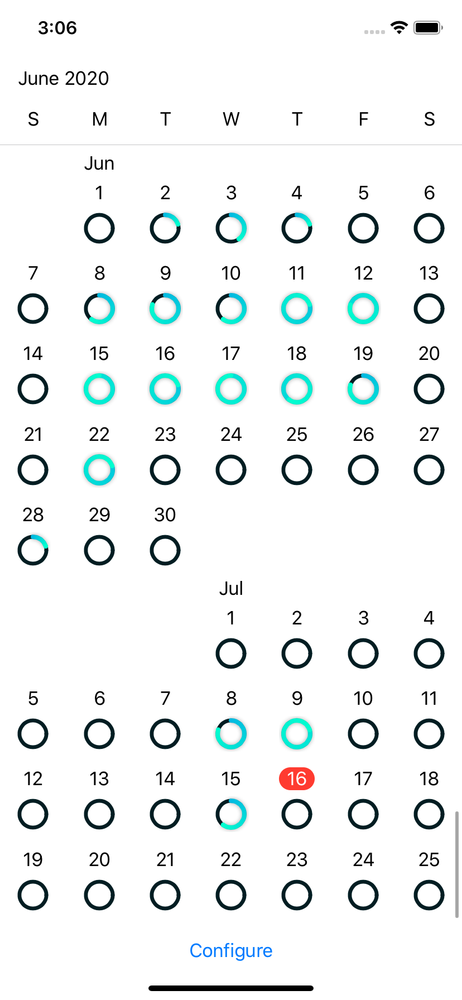

# GitHubActivity

Show GitHub contributions in a similar way the Activity app shows the move goals. Built using pure Swift UI.
Makes use of https://github.com/florin-pop/KalendarView and `RingView` from https://github.com/exyte/replicating.

Inspired by https://github.com/JustinFincher/GitHubContributionsiOS

# Screenshots

## Calendar view

## Configuration

